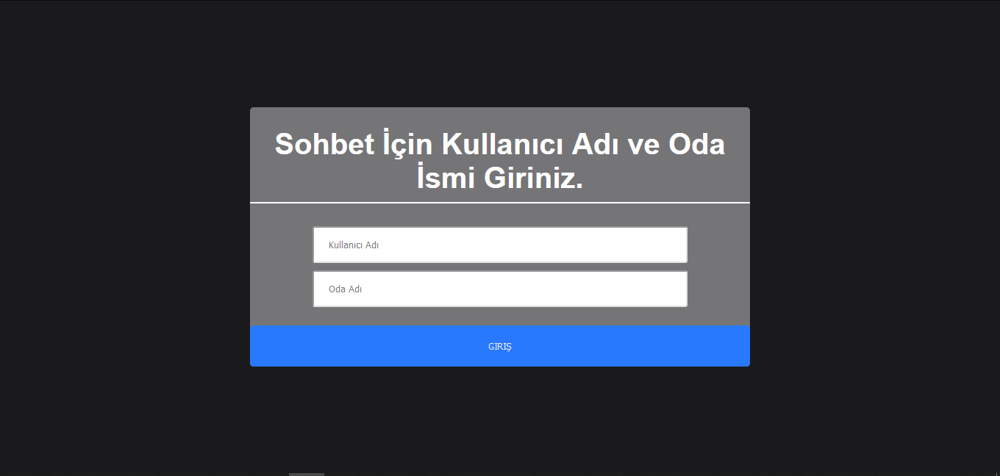
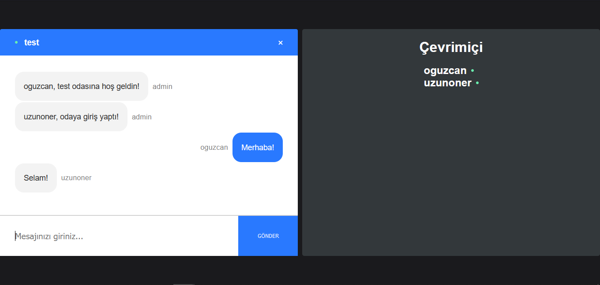

## NETLIFY DEMO

[NETLIFY DEMO - CLICK ](https://chat-v2-oguzcanuzunoner.netlify.app/)

# Sohbet Uygulaması

Uygulamamızda, bir kullanıcı adı ve belirlediğiniz oda adı ile giriş yapabiliyorsunuz. 

## Proje Hakkında

Bu projede, sohbet odası planlanmıştır. Kullanıcılar, "Kullanıcı adı" ve "Oda Adı" alanlarını doldurduktan sonra, sohbet etmek istedikleri arkadaşlarına, kendi belirledikleri "Oda Adı"nı söyleyerek, sohbet edebilirler.

## Proje Teknik Bilgileri

* Front-End için :
  
  React kullanılmıştır.
  
  Styled-Components kullanılmıştır.

  Deploy : Netlify üzerinden yapılmıştır.

* Back-End için :
  
  Node.Js Express kullanılmıştır.

  Socket.IO kullanılmıştır.

  Server : Heroku kullanılmıştır.

  CORS kullanılmıştır.

## Proje Nasıl Çalıştırılır

- Projeyi fork'ladıktan ya da indirdikten sonra projenin bulunduğu server ve web klasörlerinde "npm install" komutu ile gerekli paketlerin yüklenmesi gerekiyor.
- Daha sonra server ve client adına her birine özel  "npm start" komutu ile uygulama başlatılabilir.
  
## Ekran Görüntüsü

### Home Page

  

### Room Page

  

 
